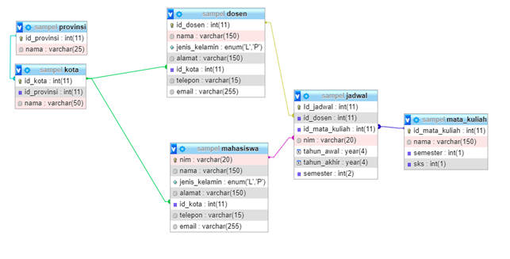

## Database

## Apa itu MVC?  
MVC adalah konsep arsitektur dalam pembangunan aplikasi berbasis web yang membagi aplikasi web menjadi 3 bagian besar. Yang mana setiap bagian memiliki tugas-tugas serta tanggung jawab masing-masing. Tiga bagian tersebut adalah: model, view dan controller.

```
Model: Bertugas untuk mengatur, menyiapkan, memanipulasi dan mengorganisasikan data (dari database) sesuai dengan instruksi dari controller.

View: Bertugas untuk menyajikan informasi (yang mudah dimengerti) kepada user sesuai dengan instruksi dari controller.

Controller: Bertugas untuk mengatur apa yang harus dilakukan model, dan view mana yang harus ditampilkan berdasarkan permintaan dari user. Namun, terkadang permintaan dari user tidak selalu memerlukan aksi dari model. Misalnya seperti menampilkan halaman form untuk registrasi user.
```
## Apa itu Express?
```
express merupakan web framework atau kerangka kerja web yang cepat, tidak beropini, dan minimalis untuk node.js. Express adalah “server-side” atau “backend” framework yang sangat handal dalam membangun API (Application Programming Interface).
```
## Apa itu Router?
```
 sebuah metode yang menggambarkan bagaimana aplikasi melakukan respon terhadap request dari client pada endpoint tertentu. End point adalah alamat uri atau path yang diakses oleh client. End point tersebut akan diakses dengan metode request tertentu seperti : GET. POST, PUT ,DELETE ataupun yang lainnya
```
## Apa itu Middleware?
```
Middleware pada dasarnya adalah ‘penengah’. Kalau dalam aplikasi middleware adalah sebuah aturan yang harus dilewati terlebih dahulu sebelum masuk kedalam sebuah sistem atau keluar dari sebuah sistem
```
